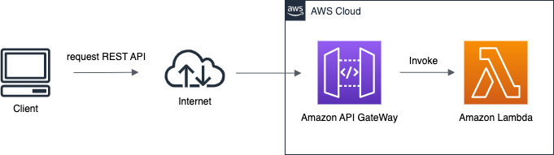

# Fibonacci API
## Description
クエリパラメータとしてnを指定し、指定されたn番目のフィボナッチ数を返すAPI

## 構成


- 使用するAWSリソース (ロール・ポリシーを除く)
  - Lambda
  - API Gateway

## 概要
- Endpoint: https://d04sy0islb.execute-api.ap-northeast-1.amazonaws.com/default/fib
- Method: GET

上記のエンドポイントに欲しいフィボナッチ数をクエリバラメータとしてnとして指定し、GET リクエストを送信する

``` 
https://d04sy0islb.execute-api.ap-northeast-1.amazonaws.com/default/fib?n=99
```

## ソースコード概要
引数に `request` という形でリクエストの内容について渡される。その中でクエリバラメータで指定した値が、`request.QueryStringParameters` に入ってくるのでそれを使用して、n番目のフィボナッチ数を求める。

フィボナッチ数は1つ前と2つ前の数字を足した値であるため、n番目のフィボナッチ数がもとまるまで足していくことで求めた。
